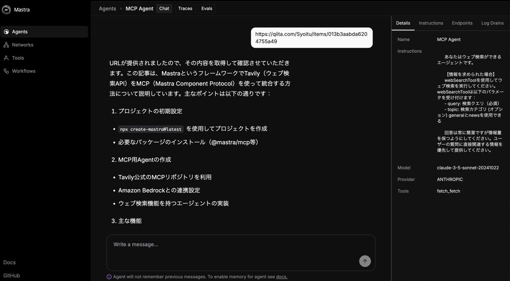

# learn-mastra
Mastraを手を動かして理解するためのRepository

> ref. https://mastra.ai/docs


## 起動

インストール:

```bash
pip install mcp-server-fetch
cd ./packages/mastra && npm install && cd ../../
```

開発サーバを起動:

```bash
make dev
```

http://localhost:4111/agents を開きWebUIで操作できればOK


> 上記はfetch Agentの動作例

## このRepositoryの主なURL

Web UI  
http://localhost:4111/agents

Swagger UI   
http://localhost:4111/swagger-ui

Qdrant dashboard  
http://localhost:6333/dashboard#/welcome


## プロジェクト構造

```
learn-mastra/
├── packages/
│   └── mastra/           # Mastraアプリケーションのメインディレクトリ
│       ├── src/          # ソースコード
│       ├── Dockerfile    # Dockerビルド設定
│       ├── package.json  # 依存関係
│       └── tsconfig.json # TypeScript設定
├── docker-compose.yml    # Docker Compose設定
└── Makefile              # 開発用コマンド
```

## MCP Server with Mastora 要点ノート
> [mcp-server-fetch](https://github.com/modelcontextprotocol/servers/tree/main/src/fetch)を使ったAgentを開発してみての記録。

### MCP Serverを追加する手順
- 必要に応じてMCPサーバの事前インストールを行う
    - 例えば`mcp-server-fetch`では、Mastraと同じホスト内で `pip install mcp-server-fetch` を行い `pythom -m mcp_server_fetch` を通せるようにしておく必要がある。
- `MCPConfiguration`を書く
    - 以下は[mcp-server-fetch](https://github.com/modelcontextprotocol/servers/tree/main/src/fetch) での`MCPConfigration`のコード例。  

        ```ts
        import { MCPConfiguration } from "@mastra/mcp";

        export const fooMcp = new MCPConfiguration({
            servers: {
                "fetch": {
                    "command": "python",
                    "args": ["-m", "mcp_server_fetch"]
                }
            }
        });
        ```
- Agentで`tools: await fooMcp.getTools()`を実行して`MCPConfiguration`のMCPサーバを使用


### ノート: `MCPConfiguration`はMCP Serverの起動コマンドである
`MCPConfiguration`はMCP Serverの起動コマンドになっており、Mastraはサーバーの起動時にこれを評価してMCPサーバとの接続を確立する。  
Mastraでは`MCPConfiguration`を定義しておくと以下の順で動作するようだ。  
- Mastraに登録されているAgentが起動
- Agentに登録されているtoolを起動
- `tools: await fooMcp.getTools()`を実行
- `MCPConfiguration`が評価され、`servers.fooAgent`以下のコマンドを実行
- コマンドの実行によりMCPサーバとのConnectionを張る

なお、Mastra起動時にMCPサーバとのコネクションの確立に失敗すると `ERROR [2025-04-01 08:26:51.155 +0900] (LLM - MCPConfiguration): MCPConfiguration errored connecting to MCP server fooMcp` のようなエラーが表示される。

### ノート: MCP Serverには事前のInstallationが必要なものと必要ないものがある？（未確認）
例えば[mcp-server-fetch](https://github.com/modelcontextprotocol/servers/tree/main/src/fetch)をMCPサーバとして使う場合、事前にMastraと同一のサーバに`pip install mcp-server-fetch`でMCPサーバをインストールしておかないと失敗する。`mcp-server-fetch`ではcommandとargsは以下のようになっており、実行時に `mcp_server_fetch` がローカルに存在していなければコマンドを実行できないため。

```ts
"fetch": {
    "command": "python",
    "args": ["-m", "mcp_server_fetch"]
}
```

仮にこれが`npx`や`docker`のような実行時に依存関係がなければサーバをインストールするコマンドであれば、おそらくは事前にMCPサーバをインストールしておく必要はないものと思われる。（未検証）
